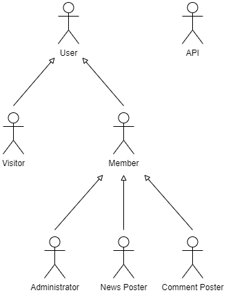

# A2: Actors and User stories

The following sections provide several details about the project, its actors and functionalities.

## 1. Actors

| Identifier | Description                                               | Examples |
|:----------:|-----------------------------------------------------------|----------|
| User | Generic user with access to public information, such as topics, news and comments.                               | n/a                   |
| Visitor | Unauthenticated user that can register itself (sign-up) or sign-in in the system.       | n/a                   |
| Member | Authenticated user that can post news, comments and edit all of its posts and comments. Can also upvote or downvote other user's posts and comments. Has the ability to follow users and topics to have a customized news feed. | jlopes                |
|  News Poster   | Authenticated user that belongs to the same location as the creator of a news item and can change/delete its existing information. | jlopes |
| Comment Poster | Authenticated user that belongs to the same location as the creator of a comment and can change/delete its existing information. | jlopes |
| Administrator | Authenticated user that is responsible for the management of users, news and comments. | admin |
| API | External APIs that can be used to register and/or authenticate into the system.                                                                                  | Google |

Table 1: Actor's description.

## 2. User Stories

### 2.1. User

| Identifier | Name | Priority | Description |
|:---:|:-------:|:----:|:-------------------------------------------:|
| US11 | Main Page News | High | As a User, I want to access the website's main page, so that I can see the latest news about gaming. |
| US12 | Profile Page | High | As a User, I want to consult the profile of a Member, so that I can see their biography,  profile picture, reputation score, number of followers and posted news. |
| US13 | Search | High | As a User, I want to search for specific news posts, topics and users so that I can easily find what I'm looking for. |
| US14 | Topic Page | High | As a User, I want to consult the page of a specific gaming topic so that I can see the latest news about that subject. |
| US15 | News Post Page | High | As a User, I want to access the page of a specific news post so that I can see more details about that post and its comments. |
| US16 | Main Page Trending Topics | Medium | As a User, I want to consult the top trending topics on the main page so that I can discover other gaming topics that are popular. |
| US17 | About Page | Low | As a User, I want to access the About page, so that I can see a complete website's description. |

Table 2: User's user stories.

### 2.2. Visitor

| Identifier | Name | Priority | Description |
|:---:|:-------:|:----:|:-------------------------------------------:|
|    US21    |        Sign Up        |   High   | As a Visitor, I want to register myself into the system, so that I can become a Member. |
|    US22    |         Log In        |   High   | As a Visitor, I want to authenticate into the system, so that I can have Member privileges. |
|    US23    | Sign Up using Google |   Medium   | As a Visitor, I want to register myself into the system using a Google account, so that I can become a Member, spending less time registering. |
|    US24    |  Log In using Google |   Medium   | As a Visitor, I want to authenticate into the system using a Google account, so that I can have Member privileges. |

Table 3: Visitor's user stories.

### 2.3. Member

| Identifier | Name | Priority | Description |
|:---:|:-------:|:----:|:-------------------------------------------:|
|   US311   |          Logout          |   High   | As a Member, I want to logout from the system, so that other users are able to login in the same computer. |
|   US321   |    Create a News Post    |   High   | As a Member, I want to create a news post for the community to read and comment, so that I can share the latest information on gaming. |
| US322 | Select a Topic | High | As a Member, when creating a news post, I want to able to select existing gaming topics related to that post, so that I can associate the news information with the respective subject/theme. |
| US323 | Create a Topic | High | As a Member, when creating a news post, I want to able to create a new gaming topic related to that post, so that I can associate the news information with the respective subject/theme. |
| US324 | Comment a News Post | High | As a Member, I want to comment on a news post, so that I can discuss and share my opinion with the community. |
| US331 | Follow a Topic | High | As a Member, I want to follow a topic, so that I can see posts related to that topic in my customized news feed. |
| US332 | Unfollow a Topic | High | As a Member, I want to unfollow a topic, so that I remove posts related to that topic from my customized news feed. |
| US333 | Follow a Member | High | As a Member, I want to follow a member, so that I can see posts created by that member in my customized news feed. |
| US334 | Unfollow a Member | High | As a Member, I want to unfollow a followed member, so that I remove posts created by that member from my customized news feed. |
|   US341   |      Rate a News Post      | High | As a Member, I want to upvote or downvote a news post based on my thoughts, so that I can affect the post's visibility. |
|   US342   |      Rate a Comment      | High | As a Member, I want to upvote or downvote a comment based on my thoughts, so that I can affect the comment's visibility. |
| US343 | Report a News Post | High | As a Member, I want to be able to report an offensive/misleading news post, so that I can contribute in keeping Gameorama safe and reliable for me and other users. |
|   US344   | Report a Comment |  High  | As a Member, I want to be able to report an offensive/misleading comment, so that I can contribute in keeping Gameorama safe and reliable for me and other users. |
|   US345   |    Bookmark a News Post    | High | As a Member, I want to bookmark interesting news posts so that I can review them later. |
| US346 | Remove Bookmarked a News Post | High | As a Member, I want to remove a Bookmarked news post so that I can delete them from my profile page. |
|   US351   | View my Posted News Posts  | High | As a Member, I want to be able so see in my profile page the news posts I've created so that I can easily access them. |
| US352 |      View my Comments      | High | As a Member, I want to be able so see in my profile page the comments I've posted so that I can easily access them. |
|   US353   | View Bookmarked News Posts | High | As a Member, I want to be able so see in my profile page the news posts I've bookmarked so that I can easily access them. |
| US354 | Edit Profile Information | High | As a Member, I want to edit my own profile information (e.g. name, profile picture, biography), so that it can be up to date. |
| US355 | Edit Account  Settings | High | As a Member, I want to edit my account settings (e.g. email, password), so that I can keep my account safe. |
|   US361   | Notifications | Medium | As a Member, I want to get notified when another Member follows me or comments on my post so that I can know when and who followed me/commented on my post faster. |

Table 4: Member's user stories.

### 2.4. News Poster

| Identifier | Name | Priority | Description |
|:---:|:-------:|:----:|:-------------------------------------------:|
|   US41   | Edit my News Post |  High  | As a News Poster, I want to be able to edit my news post so that I can change its information when needed. |
|   US42   | Delete my News Post | High | As a News Poster, I want to be able to delete my news post so that I can remove it in case it contains misleading information. |

Table 5: News Poster's user stories.

### 2.5. Comment Poster

| Identifier |       Name        | Priority |                         Description                          |
| :--------: | :---------------: | :------: | :----------------------------------------------------------: |
|    US51    |  Edit my Comment  |   High   | As a Comment Poster, I want to be able to edit my comment so that I can change its information when needed. |
|    US52    | Delete my Comment |   High   | As a Comment Poster, I want to be able to delete my comment so that I can remove it in case it contains misleading information or doesn't contribute to the discussion. |

Table 6: Comment Poster's user stories.

### 2.6. Administrator

| Identifier | Name | Priority | Description |
|:---:|:-------:|:----:|:-------------------------------------------:|
|   US61   | Delete a News Post |   High   | As an Administrator, I want to be able to delete a news post so that I can remove it in case it contains misleading information. |
|   US62   |   Delete a Comment    |   High   | As an Administrator, I want to be able to delete a comment so that I can remove it in case it contains misleading information or doesn't contribute to the discussion. |
|   US63   | Delete/Ban an account |   High   | As an Administrator, I want to be able to delete an account so that I can ban members that post offensive/misleading content on the website. |
| US64 | Delete a Topic | High | As an Administrator, I want to be able to delete a topic so that I can remove topics that are offensive or contain misleading information. |

Table 7: Administrator's user stories.

## 3. Supplementary requirements

### 3.1. Business rules

| Identifier | Name | Description |
|:----------:|:---------------:|:---------------------------------------------------------------------------:|
|    BR01    |    Rating System    | A member can only upvote OR downvote a news post/comment, not both at the same time. |
|    BR02    |   News Aura Score   | A News Aura Score is calculated by the following formula: News Post's Number of Upvotes - News Post's Number of Downvotes. |
|    BR03    | Comment Aura Score  | A Comment Aura Score is calculated by the following formula: Comment's Number of Upvotes - Comment's Number of Downvotes. |
| BR04 | Member's Aura score | A Member's Aura score is calculated according to the formula: All Member's News Aura + All Member's Comment Aura. |
| BR05 | Auto Upvote | A newly created post always has its creator's own upvote automatically (although it can be removed later). |
| BR06 | Edited Post | An edited post is adequately marked with an asterisk (*). |
| BR07 | Edited Comment | An edited comment is adequately marked with an asterisk (*). |
| BR08 | News Poster | A News Poster is identified with a special icon (A microphone) when they comment on their own post. |
| BR09 | Administrator | An Administrator is identified with a special icon (A shield) when they post or comment in the website. |
| BR10 | New News Posts | A News Post must always have at least 1 topic assigned to it. |
| BR11 | Deleted Member | A deleted Member has all their content on the website deleted (profile, news posts and comments). |
| BR12 | Deleted Topic | A deleted Topic has all its content deleted (news posts and comments). |
| BR13 | Comment Date | A Comment's date must be after its Post's date |

### 3.2. Technical requirements

| Identifier | Name | Description |
|:----------:|:---------------:|:---------------------------------------------------------------------------:|
| TR01       | Availability    | The system must be available 99 percent of the time in each 24-hour period. |
| TR02       | Accessibility   | The system must ensure that everyone can access the pages, regardless of whether they have any handicap or not, or the Web browser they use. |
| TR03       | Usability       | The system should be simple and easy to use. |
| TR04       | Performance     | The system should have response times shorter than 2s to ensure the user's attention. |
| TR05       | Web application | The system should be implemented as a Web application with dynamic pages (HTML5, JavaScript, CSS3 and PHP). |
| TR06       | Portability     | The server-side system should work across multiple platforms (Linux, Mac OS, etc.). |
| TR07       | Database        | The PostgreSQL 13.0 database management system must be used. |
| TR08       | Security        | The system shall protect information from unauthorized access through the use of an authentication and verification system. |
| TR09       | Robustness      | The system must be prepared to handle and continue operating when runtime errors occur. |
| TR10       | Scalability     | The system must be prepared to deal with the growth in the number of users and their actions. |
| TR11       | Ethics          | The system must respect the ethical principles in software development (for example, the password must be stored encrypted to ensure that only the owner knows it). |

### 3.3. Restrictions

| Identifier | Name | Description |
|:----------:|:---------------:|:---------------------------------------------------------------------------:|
| C01        | Deadline    | The system should be ready to be used at the beginning of the Summer, so gamers can use the website during their holidays. |

***

GROUP2133, 18/02/2021